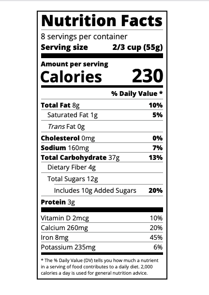

# Nutrition Label Project

## Overview

This project is a responsive and interactive nutrition label that visually displays nutritional information similar to what you might find on a food package. It uses HTML and CSS to create a clear and concise layout for representing nutritional values such as fats, carbohydrates, and vitamins.

 <!-- Update with a real path to the screenshot -->

## Features

- Displays a variety of nutritional information.
- Utilizes HTML and CSS for layout and styling.
- Includes classes for easy styling and alignment.
- Responsive design for different screen sizes.

## Technologies Used

- HTML5
- CSS3

## Installation

To set up this project on your local machine, follow these steps:

1. **Clone the Repository:**

   ```bash
   git clone https://github.com/Researcher0619/nutrition-label-project.git
   ```

### README.md Summary

1. **Overview**: A brief description of what your project is about.
2. **Features**: Key features provided by the project.
3. **Technologies Used**: List of technologies used in the project.
4. **Installation**: Steps to set up your project on a local machine.
5. **Usage**: Information on how to view and modify the project.
6. **Example Code**: Example HTML code from the project.
7. **Contributing**: Instructions for those who wish to contribute.
8. **License**: Licensing information.
9. **Acknowledgements**: Thanks to FreeCodeCamp Academy, including a link to their resources.

**Note:** When using the README file, remember to replace "path/to/your/screenshot.png" with the actual path to your project screenshot, "<https://github.com/Researcher0619/nutrition-label-project.git>" with your actual GitHub repository link, and "<ozkanceyhan3419@gmail.com>" with your real contact email.
